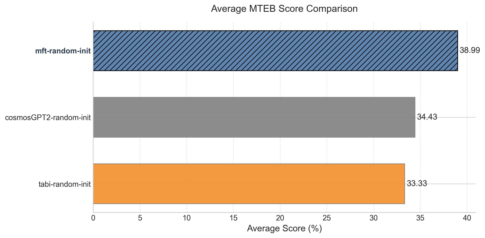

# MTEB Benchmark Results Report

# 🏆 Detailed Task Results

| Task                                   | Category            | embeddinggemma-300m | embeddingmagibu-200m | mft-downstream-task-embeddinggemma | mft-downstream-task-embeddingmagibu | mft-random-init | tabi-downstream-task-embeddinggemma | tabi-downstream-task-embeddingmagibu | tabi-random-init |
| -------------------------------------- | ------------------- | ------------------- | -------------------- | ---------------------------------- | ----------------------------------- | --------------- | ----------------------------------- | ------------------------------------ | ---------------- |
| ArguAnaTR                              | Other               | **50.27%**          | 45.41%               | 44.86%                             | 40.49%                              | 7.62%           | 42.08%                              | 41.09%                               | 2.56%            |
| CQADupstackGamingRetrievalTR           | Retrieval           | **54.69%**          | 51.23%               | 52.35%                             | 48.45%                              | 13.00%          | 51.20%                              | 49.16%                               | 6.73%            |
| FiQA2018TR                             | Other               | 40.47%              | **45.19%**           | 37.13%                             | 35.43%                              | 6.74%           | 37.25%                              | 35.94%                               | 2.38%            |
| MSMarcoTRRetrieval                     | Retrieval           | 54.84%              | **57.37%**           | 53.96%                             | 51.73%                              | 12.84%          | 53.17%                              | 53.55%                               | 4.83%            |
| MnliTr                                 | Pair Classification | 59.38%              | **66.84%**           | 55.38%                             | 60.58%                              | 48.46%          | 57.13%                              | 60.31%                               | 44.98%           |
| NFCorpusTR                             | Retrieval           | 9.13%               | **10.67%**           | 7.90%                              | 7.83%                               | 1.22%           | 9.53%                               | 10.07%                               | 0.73%            |
| QuoraRetrievalTR                       | Retrieval           | 94.28%              | **94.55%**           | 93.27%                             | 92.72%                              | 63.01%          | 92.90%                              | 92.69%                               | 46.98%           |
| SCIDOCSTR                              | Other               | 3.26%               | 2.71%                | **3.41%**                          | 2.88%                               | 0.47%           | 3.21%                               | 3.16%                                | 0.74%            |
| STSbTR                                 | STS                 | 72.93%              | **77.47%**           | 72.94%                             | 74.73%                              | 49.36%          | 71.47%                              | 72.41%                               | 33.24%           |
| SciFactTR                              | Retrieval           | **86.32%**          | 74.76%               | 79.59%                             | 76.69%                              | 25.64%          | 79.41%                              | 77.29%                               | 15.16%           |
| SnliTr                                 | Pair Classification | 54.73%              | **60.84%**           | 52.77%                             | 56.27%                              | 44.73%          | 54.17%                              | 56.44%                               | 40.04%           |
| SquadTRRetrieval                       | Retrieval           | **73.26%**          | 62.38%               | 69.84%                             | 68.77%                              | 16.53%          | 68.72%                              | 69.25%                               | 6.14%            |
| THYSentimentClassification             | Classification      | 59.17%              | **59.56%**           | 55.40%                             | 57.80%                              | 51.48%          | 57.21%                              | 58.16%                               | 43.02%           |
| TQuadRetrieval                         | Retrieval           | 84.98%              | 79.48%               | 82.42%                             | 82.82%                              | 43.46%          | 83.81%                              | **85.97%**                           | 26.30%           |
| TSTimelineNewsCategoryClassification   | Classification      | **63.10%**          | 58.67%               | 59.94%                             | 57.09%                              | 50.06%          | 60.29%                              | 59.53%                               | 44.09%           |
| Turkish75NewsClassification            | Classification      | **96.00%**          | 91.33%               | 86.67%                             | 90.67%                              | 73.33%          | 92.00%                              | 94.00%                               | 79.33%           |
| TurkishAbstractCorpusClustering        | Retrieval           | **61.93%**          | 59.03%               | 61.00%                             | 58.91%                              | 47.46%          | 60.66%                              | 59.43%                               | 39.69%           |
| TurkishColumnWritingClustering         | Clustering          | 62.78%              | 63.71%               | 62.66%                             | 61.42%                              | **66.30%**      | 62.02%                              | 62.61%                               | 65.71%           |
| TurkishIronyClassification             | Classification      | **55.17%**          | 52.92%               | 51.17%                             | 53.25%                              | 51.25%          | 51.75%                              | 51.33%                               | 52.50%           |
| TurkishMovieSentimentClassification    | Classification      | **78.16%**          | 71.89%               | 71.47%                             | 66.18%                              | 54.74%          | 72.68%                              | 69.38%                               | 53.84%           |
| TurkishNewsCategoryClassification      | Classification      | 90.92%              | 88.76%               | **91.32%**                         | 91.04%                              | 85.40%          | 90.96%                              | 91.28%                               | 79.08%           |
| TurkishOffensiveLanguageClassification | Classification      | **64.69%**          | 63.93%               | 58.63%                             | 59.33%                              | 49.87%          | 58.36%                              | 58.96%                               | 48.22%           |
| TurkishProductSentimentClassification  | Classification      | **67.25%**          | 60.98%               | 63.84%                             | 61.16%                              | 54.34%          | 61.31%                              | 60.59%                               | 52.10%           |
| WMT16BitextMining                      | BitextMining        | 96.88%              | **97.02%**           | 90.80%                             | 91.82%                              | 1.53%           | 92.71%                              | 94.26%                               | 1.39%            |
| XNLI                                   | Pair Classification | 67.61%              | **75.96%**           | 62.71%                             | 67.93%                              | 57.55%          | 65.17%                              | 68.86%                               | 57.28%           |
| XQuADRetrieval                         | Retrieval           | **93.14%**          | 88.10%               | 92.79%                             | 91.60%                              | 37.33%          | 92.21%                              | 91.76%                               | 19.54%           |

python evaluate_sts_tr.py -m magibu/embeddingmagibu-200m google/embeddinggemma-300m alibayram/mft-downstream-task-embeddingmagibu alibayram/mft-downstream-task-embeddinggemma alibayram/tabi-downstream-task-embeddingmagibu alibayram/tabi-random-init alibayram/tabi-downstream-task-embeddinggemma alibayram/mft-random-init

# 📂 Categorized Results

| Category            | embeddinggemma-300m | embeddingmagibu-200m | mft-downstream-task-embeddinggemma | mft-downstream-task-embeddingmagibu | mft-random-init | tabi-downstream-task-embeddinggemma | tabi-downstream-task-embeddingmagibu | tabi-random-init |
| ------------------- | ------------------- | -------------------- | ---------------------------------- | ----------------------------------- | --------------- | ----------------------------------- | ------------------------------------ | ---------------- |
| BitextMining        | 96.88%              | **97.02%**           | 90.80%                             | 91.82%                              | 1.53%           | 92.71%                              | 94.26%                               | 1.39%            |
| Classification      | **71.81%**          | 68.51%               | 67.30%                             | 67.06%                              | 58.81%          | 68.07%                              | 67.90%                               | 56.52%           |
| Clustering          | 62.78%              | 63.71%               | 62.66%                             | 61.42%                              | **66.30%**      | 62.02%                              | 62.61%                               | 65.71%           |
| Other               | **31.33%**          | 31.10%               | 28.47%                             | 26.27%                              | 4.94%           | 27.52%                              | 26.73%                               | 1.89%            |
| Pair Classification | 60.57%              | **67.88%**           | 56.95%                             | 61.59%                              | 50.25%          | 58.82%                              | 61.87%                               | 47.43%           |
| Retrieval           | **68.06%**          | 64.18%               | 65.90%                             | 64.39%                              | 28.94%          | 65.73%                              | 65.46%                               | 18.46%           |
| STS                 | 72.93%              | **77.47%**           | 72.94%                             | 74.73%                              | 49.36%          | 71.47%                              | 72.41%                               | 33.24%           |

# 📊 Overall Average Scores

| Model                                | Average Score | Tasks Evaluated |
| ------------------------------------ | ------------- | --------------- |
| **embeddinggemma-300m**              | **65.21%**    | 26              |
| embeddingmagibu-200m                 | 63.88%        | 26              |
| tabi-downstream-task-embeddingmagibu | 62.59%        | 26              |
| tabi-downstream-task-embeddinggemma  | 62.36%        | 26              |
| mft-downstream-task-embeddinggemma   | 62.09%        | 26              |
| mft-downstream-task-embeddingmagibu  | 61.83%        | 26              |
| mft-random-init                      | 38.99%        | 26              |
| tabi-random-init                     | 33.33%        | 26              |

