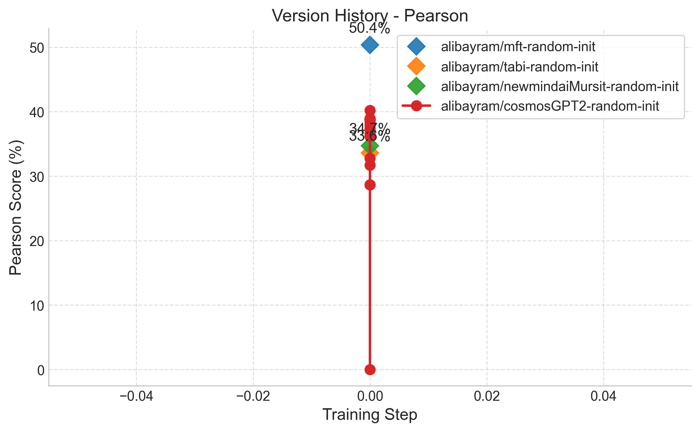
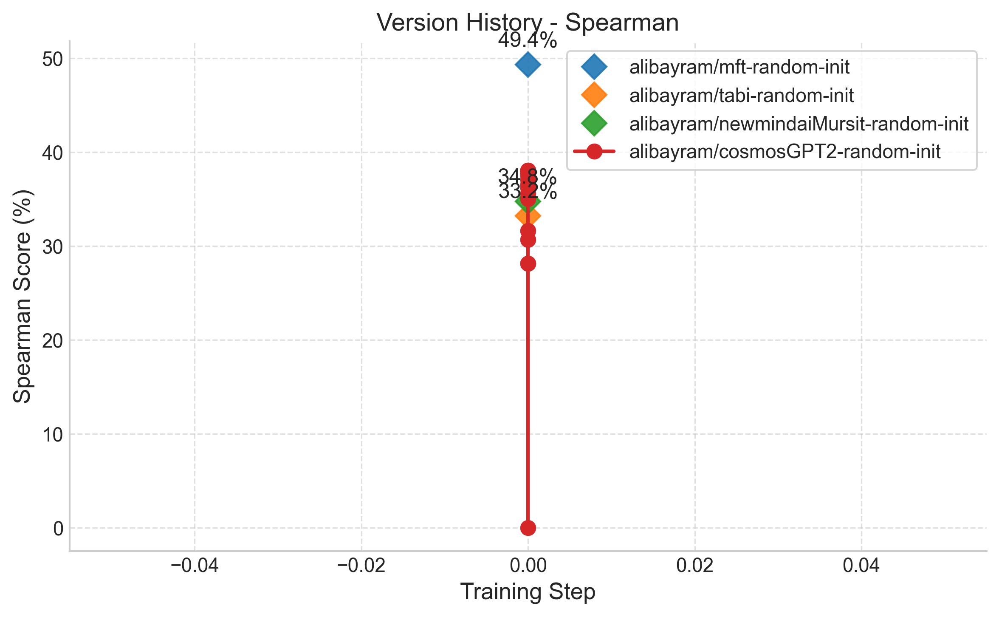

# Version Benchmark Results Report

# 📝 Detailed Analysis Summary

### 🏆 Overall Best Performance

The best performing model version is **alibayram/mft-random-init** (Rev: `N/A`) with a Pearson score of **50.37%** and Spearman of **49.35%**.

## Performance Charts

### Pearson Correlation

### Spearman Correlation

# 📜 Detailed Version History

## alibayram/cosmosGPT2-random-init

| Date | Revision | Pearson | Spearman | Samples |
| --- | --- | --- | --- | --- |
| 2026-01-28 10:51:34 | N/A | 38.91% | 38.03% | 1379 |
| 2026-01-28 10:48:39 | N/A | 38.94% | 38.05% | 1379 |
| 2026-01-28 10:43:28 | N/A | 38.91% | 38.05% | 1379 |
| 2026-01-28 10:38:27 | N/A | 38.88% | 38.00% | 1379 |
| 2026-01-28 10:33:19 | N/A | 38.82% | 37.96% | 1379 |
| 2026-01-28 10:28:06 | N/A | 38.85% | 37.97% | 1379 |
| 2026-01-28 10:23:01 | N/A | 38.78% | 37.92% | 1379 |
| 2026-01-28 10:17:50 | N/A | 38.75% | 37.89% | 1379 |
| 2026-01-28 10:12:46 | N/A | 38.68% | 37.85% | 1379 |
| 2026-01-28 10:07:33 | N/A | 38.57% | 37.74% | 1379 |
| 2026-01-28 10:02:30 | N/A | 38.35% | 37.53% | 1379 |
| 2026-01-28 09:57:31 | N/A | 37.90% | 37.08% | 1379 |
| 2026-01-28 09:52:32 | N/A | 37.42% | 36.59% | 1379 |
| 2026-01-28 09:47:32 | N/A | 37.25% | 36.45% | 1379 |
| 2026-01-28 09:42:33 | N/A | 37.17% | 36.22% | 1379 |
| 2026-01-28 09:37:31 | N/A | 36.57% | 35.62% | 1379 |
| 2026-01-28 09:32:31 | N/A | 36.19% | 35.14% | 1379 |
| 2026-01-28 09:27:31 | N/A | 36.22% | 35.02% | 1379 |
| 2026-01-28 04:35:55 | N/A | 28.66% | 28.17% | 1379 |
| 2026-01-28 01:35:43 | N/A | 31.73% | 30.67% | 1379 |
| 2026-01-28 01:20:16 | N/A | 28.66% | 28.16% | 1379 |
| 2026-01-28 01:15:15 | N/A | 32.75% | 31.65% | 1379 |
| 2026-01-28 00:28:11 | N/A | 40.20% | 37.75% | 1379 |
| 2026-01-28 00:25:15 | N/A | 0.00% | 0.00% | None |

## alibayram/mft-random-init

| Date | Revision | Pearson | Spearman | Samples |
| --- | --- | --- | --- | --- |
| 2026-01-26 21:35:59 | N/A | 50.37% | 49.35% | 1379 |

## alibayram/newmindaiMursit-random-init

| Date | Revision | Pearson | Spearman | Samples |
| --- | --- | --- | --- | --- |
| 2026-01-28 04:35:55 | N/A | 34.72% | 34.77% | 1379 |

## alibayram/tabi-random-init

| Date | Revision | Pearson | Spearman | Samples |
| --- | --- | --- | --- | --- |
| 2026-01-26 21:35:59 | N/A | 33.58% | 33.24% | 1379 |

